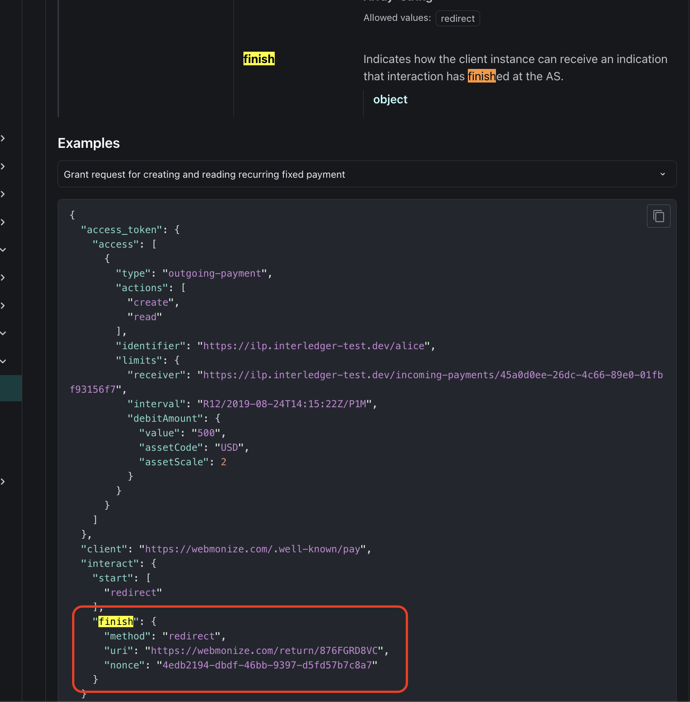

# English

##  Hackathon's Backend Example
This repository can be used as an example backend, based on Express.js with TypeScript and Sequelize ORM for database management.

### Features
- Express.js with TypeScript
- Sequelize ORM for MySQL database
- CORS enabled for frontend integration
- RESTful API endpoints for:
  - Dueños (Owners)
  - Domicilios (Properties)
  - Recibos (Receipts)
- Environment-based configuration
- Database auto-sync and initialization

### The backend is necessary for the grant:
> https://openpayments.dev/apis/auth-server/operations/post-request/



## Prerequisites

### Install the correct Node version
#### Manually
See Node.js documentation to install version v24
https://nodejs.org/en

#### Using NVM
If you don't already have Node.js v24 installed, you can use NVM to install it

Follow these instructions: 
https://github.com/nvm-sh/nvm?tab=readme-ov-file#installing-and-updating

Once NVM is installed, run this in the directory of the project (where the .nvmrc is)

```
nvm install
nvm use
```


## Install dependencies
```
npm i
```

## Database Setup
1. Install MySQL Server on your system
2. Create a database named `condominios_db`
3. Copy the environment file:
   ```
   cp .env.example .env
   ```
4. Update the `.env` file with your database credentials:
   ```
   DB_HOST=localhost
   DB_NAME=condominios_db
   DB_USER=your_username
   DB_PASSWORD=your_password
   ```

## Development
For development with auto-reload:
```
npm run dev
```

## Build
```
npm run build
```

## Start the backend service (Production)
```
npm run start
```

## API Endpoints

### Core Endpoints
- `GET /` - Health check
- `GET /health` - Server status
- `GET /example_params?name=value` - Example with parameters
- `POST /example_post` - Example POST request

### API Routes (prefix: /api)
- `GET /api/duenos` - Get all owners
- `GET /api/duenos/:id` - Get owner by ID
- `POST /api/duenos` - Create new owner
- `PUT /api/duenos/:id` - Update owner
- `DELETE /api/duenos/:id` - Delete owner

- `GET /api/domicilios` - Get all properties
- `GET /api/domicilios/:id` - Get property by ID
- `GET /api/domicilios/:id/recibos` - Get property receipts

- `GET /api/recibos` - Get all receipts
- `GET /api/recibos/:id` - Get receipt by ID
- `POST /api/recibos` - Create new receipt
- `PUT /api/recibos/:id` - Update receipt
- `DELETE /api/recibos/:id` - Delete receipt

## Examples

### Example of simple GET request using fetch
``` javascript
const response = await fetch("http://localhost:3000/");
if (!response.ok) {
    throw new Error(`Response status with error: ${response.status}`);
}

const resultBody = await response.json();
console.log(`Response body is: ${resultBody}`);
```

### Example of GET with parameters request using fetch
``` javascript
const response = await fetch("http://localhost:3000/example_params?name=pedro");
if (!response.ok) {
    throw new Error(`Response status with error: ${response.status}`);
}

const resultBody = await response.json();
console.log(`Response body is: ${resultBody}`);
```

### Example of POST request using fetch
``` javascript
const response = await fetch("http://localhost:3000/example_post", {
  method: "POST",
  headers: {
    "Content-Type": "application/json",
  },
  body: JSON.stringify({ "wallet_address": "my_wallet_address" }),
});

if (!response.ok) {
  throw new Error(`Response status with error: ${response.status}`);
}

const resultBody = await response.json();
console.log(`Response body is: ${resultBody}`);
```

# Spanish

Aquí tienes la traducción al español de las instrucciones:

---

## Ejemplo de Backend para Hackathon

Este repositorio puede usarse como un ejemplo de backend, basado en Express.js.

### El backend es necesario para la grant:
> https://openpayments.dev/apis/auth-server/operations/post-request/


## Instalar la versión correcta de Node

#### Manualmente

Consulta la documentación de Node.js para instalar la versión v24
[https://nodejs.org/en](https://nodejs.org/en)

#### Usando NVM

Si aún no tienes instalado Node.js v24, puedes usar NVM para instalarlo.

Sigue estas instrucciones:
[https://github.com/nvm-sh/nvm?tab=readme-ov-file#installing-and-updating](https://github.com/nvm-sh/nvm?tab=readme-ov-file#installing-and-updating)

Una vez que NVM esté instalado, ejecuta esto en el directorio del proyecto (donde se encuentra el archivo `.nvmrc`):

```
nvm install
nvm use
```

## Instalar dependencias

```
npm i
```

## Construir

```
npm run build
```

## Iniciar el servicio backend

```
npm run start
```

## Ejemplos

### Ejemplo de petición GET simple usando fetch

```javascript
const response = await fetch("http://localhost:3000/");
if (!response.ok) {
    throw new Error(`Estado de la respuesta con error: ${response.status}`);
}

const resultBody = await response.json();
console.log(`El cuerpo de la respuesta es: ${resultBody}`);
```

### Ejemplo de petición GET con parámetros usando fetch

```javascript
const response = await fetch("http://localhost:3000/example_params?name=pedro");
if (!response.ok) {
    throw new Error(`Estado de la respuesta con error: ${response.status}`);
}

const resultBody = await response.json();
console.log(`El cuerpo de la respuesta es: ${resultBody}`);
```

### Ejemplo de petición POST usando fetch

```javascript
const response = await fetch("http://localhost:3000/example_post", {
  method: "POST",
  headers: {
    "Content-Type": "application/json",
  },
  body: JSON.stringify({ "wallet_address": "mi_direccion_wallet" }),
});

if (!response.ok) {
  throw new Error(`Estado de la respuesta con error: ${response.status}`);
}

const resultBody = await response.json();
console.log(`El cuerpo de la respuesta es: ${resultBody}`);
```

---
¿Quieres que también adapte la parte de los ejemplos de código (mensajes de error y logs) al español para que quede todo consistente?

